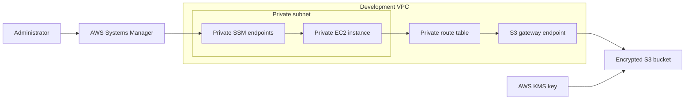

# Secure AWS Development Environment

This project uses Terraform to deploy a secure private development environment in AWS. It demonstrates infrastructure automation, private networking, least-privilege access, encryption, and automated security scanning.

## Architecture



## AWS Resources

- Development VPC
- Private subnet and route table
- Private Amazon Linux EC2 instance
- S3 bucket for development files
- S3 gateway endpoint
- Systems Manager interface endpoints
- EC2 IAM role and instance profile
- Customer-managed KMS key
- Restricted security groups

## Security Features

- No public IP address on EC2
- No inbound SSH access
- Administrative access through Session Manager
- Private connectivity through VPC endpoints
- IAM roles instead of credentials stored on EC2
- Least-privilege S3 permissions
- S3 public access blocked
- S3 versioning and lifecycle management
- KMS encryption for S3 objects
- Encrypted EC2 root volume
- Instance Metadata Service Version 2 required
- Restricted default security group
- Terraform state and sensitive variable files excluded from Git

## DevSecOps Pipeline

GitHub Actions automatically checks the Terraform configuration when code is pushed to GitHub.

The workflow runs:

1. `terraform fmt -check`
2. `terraform init`
3. `terraform validate`
4. Checkov security scanning

The pipeline identifies insecure Terraform configurations before infrastructure changes are deployed.

Infrastructure deployment is performed manually after reviewing the Terraform plan.

## Project Structure

```text
.
├── .github/
│   └── workflows/
│       └── terraform-security.yml
└── terraform/
    └── environments/
        └── dev/
            ├── compute.tf
            ├── endpoints.tf
            ├── iam.tf
            ├── main.tf
            ├── outputs.tf
            ├── providers.tf
            ├── security-groups.tf
            ├── storage.tf
            └── variables.tf
```

## Deployment

Configure a dedicated AWS IAM identity and select its AWS CLI profile:

```bash
export AWS_PROFILE=terraform-lab
export AWS_REGION=us-east-2
```

Confirm the AWS identity:

```bash
aws sts get-caller-identity
```

Initialize and validate Terraform:

```bash
cd terraform/environments/dev
terraform init
terraform fmt -check
terraform validate
```

Review and deploy the infrastructure:

```bash
terraform plan -out=tfplan
terraform apply tfplan
```

Do not commit AWS credentials, Terraform state files, saved plans, or sensitive `.tfvars` files.

## Administrative Access

The EC2 instance is accessed using AWS Systems Manager Session Manager. This removes the need for a public IP address, port 22, SSH keys, or a bastion host.

## Important Notes

- This project is intended as a development and portfolio lab.
- VPC Flow Logs and cross region S3 replication are outside the current lab scope.
- Interface endpoints, EC2, KMS, S3, and detailed monitoring may generate AWS charges.
- Run `terraform plan` before every deployment and review all proposed changes.

